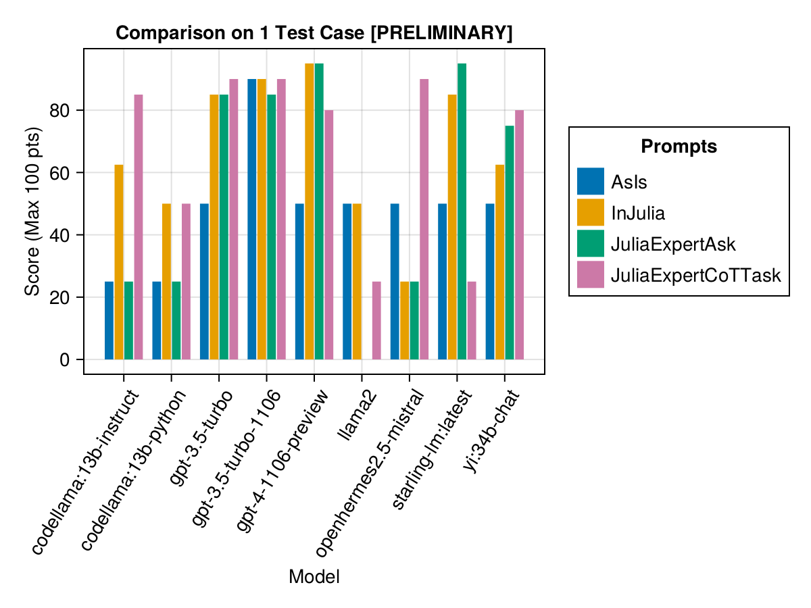

# Julia LLM Leaderboard

Comparison of Julia language generation capabilities of various Large Language Models

> [!WARNING]  
> This is a work in progress (pre-0.1.0). Please check back later for more updates.

- [Julia LLM Leaderboard](#julia-llm-leaderboard)
  - [Introduction](#introduction)
  - [Test Cases](#test-cases)
  - [Automated Evaluation Methodology](#automated-evaluation-methodology)
  - [Results (Preview)](#results-preview)
  - [Contributing Your Test Case](#contributing-your-test-case)
    - [Anatomy of `definition.toml`](#anatomy-of-definitiontoml)
  - [Running Evaluation / Adding More Results](#running-evaluation--adding-more-results)
  - [Feedback and Improvements](#feedback-and-improvements)

## Introduction
Welcome to the Julia Code Generation Benchmark Repository! 

This project is designed for the Julia community to compare the code generation capabilities of various AI models. Unlike academic benchmarks, our focus is practicality and simplicity: "Generate code, run it, and see if it works(-ish)." 

This repository aims to understand how different AI models and prompting strategies perform in generating syntactically correct Julia code to guide users in choosing the best model for their needs.

## Test Cases
Test cases are defined in a `definition.toml` file, providing a standard structure for each test. If you want to contribute a test case, please follow the instructions in the [Contributing Your Test Case](#contributing-your-test-case) section.

## Automated Evaluation Methodology
Each model's and prompt's performance is evaluated based on several criteria:
1. **Parsing**: Does the generated code parse correctly in Julia?
2. **Execution**: Can the code execute without errors?
3. **Unit Tests**: Do the included unit tests pass?
4. **Example Runs**: Does the code run in a provided example scenario?

At the moment, all criteria are weighed equally and each test case can earn a maximum of 100 points. If a code passes all criteria, it gets 100/100 points. If it fails one criterion (eg, all unit tests), it gets 75/100 points. If it fails two criteria (eg, it runs but all examples and unit tests are broken), it gets 50 points, and so on.

## Results (Preview)
To provide a glimpse of the repository's functionality, we have included example results for the first 5 test cases. 

> [!WARNING]  
> These scores will change soon as the smaller models were unfairly punished by their output format.

The below table reflects the performance of different model+prompt combinations on the test cases:

| model                  | AsIs  | InJulia           | JuliaExpertAsk | JuliaExpertCoTTask | AverageScore |
|------------------------|-------|-------------------|----------------|--------------------|--------------|
|     gpt-4-1106-preview | 53.75 | 53.08333333333333 |          74.75 |               46.0 |         56.9 |
|     gpt-3.5-turbo-1106 |  48.0 |              58.0 |           32.0 |              63.75 |         50.4 |
|          gpt-3.5-turbo |  40.0 |              49.0 |           62.0 |               38.0 |         47.2 |
|        stablelm-zephyr |  50.0 |              35.0 |           35.0 |               25.0 |         36.2 |
|            yi:34b-chat |  40.0 |              27.5 |          30.75 |               41.0 |         34.8 |
| codellama:13b-instruct |  35.0 |              37.5 |           25.0 |               39.0 |         34.1 |
|   codellama:13b-python |  45.0 |              35.0 |           25.0 |               30.0 |         33.8 |
|                 llama2 |  45.0 |              50.0 |           10.0 |               20.0 |         31.2 |
|     starling-lm:latest |  40.0 |              27.0 |           34.0 | 23.333333333333332 |         31.1 |
|              magicoder |  50.0 |              40.0 |           10.0 |               20.0 |         30.0 |
|  openhermes2.5-mistral |  40.0 |              15.0 |           10.0 |               23.0 |         22.0 |

Or we can display it as a bar chart:

We hope to be able to provide some guidance around prompting strategies, eg, when is it better to use a "JuliaExpert*" prompt template vs an "In Julia, xyz" prompt.
From the single test case, we can see that using prompts "as is" (ie, just throw the task in), did not work that well (the extra long elapsed time is probably a fluke)!

| prompt_label       | Elapsed (s) | Avg. Score (Max 100 pts) |
|--------------------|-------------|--------------------------|
|               AsIs |        27.8 |                     44.2 |
|            InJulia |        19.7 |                     38.8 |
| JuliaExpertCoTTask |        26.2 |                     33.6 |
|     JuliaExpertAsk |        30.0 |                     31.7 |

Make your own analysis with `examples/summarize_results.jl`!

## Contributing Your Test Case
To contribute a test case:

1. **Naming Convention**: Create nested folders following the format `code_generation/category/test_case_name/definition.toml`.
2. **Saving Results**: Store the full conversation and the evaluation results in a path nested by a model name like `code_generation/category/test case/model/evaluation__PROMPT__STRATEGY__TIMESTAMP.json` and `code_generation/category/test case/model/conversation__PROMPT__STRATEGY__TIMESTAMP.json`

### Anatomy of `definition.toml`
Required fields in `definition.toml` include:
- **name**: Corresponding to the file path.
- **contributor**: The creator of the test case (and their collaborators).
- **criteria**: The evaluation criteria (eg, parsing, execution, unit_tests, examples).
- **prompt**: The problem statement or task.
- **version**: The version of the test case. Starts at "1.0".
- **examples**: Example scenarios for testing, provided as a vector of executable statements using the function name (eg, `my_function(1, 2)`).
- **unit_tests**: Tests to validate the code, provided as a vector of `@test X = Z` statements.
- **packages**: Packages that are made available to the model (to avoid failures due to a failed dependency).

See an example in `examples/create_definition.jl`.

## Running Evaluation / Adding More Results
1. **Existing Evaluations**: Check `scripts/code_gen_benchmark.jl` for the example of previous evaluations.
2. **Run Your Evaluation**: Choose your model and prompt, and run the test.
3. **Save Results**: Store both the conversation and the evaluation.
4. **Open a PR**: Include the part of the code snippet you changed in the PR comments. We generally require 1-2 independent verifications of your result.

## Feedback and Improvements
We highly value community input. If you have suggestions or ideas for improvement, please open an issue. All contributions are welcome!