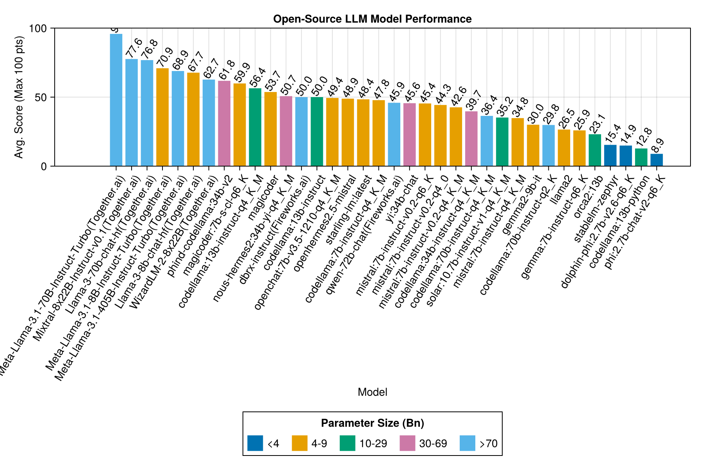
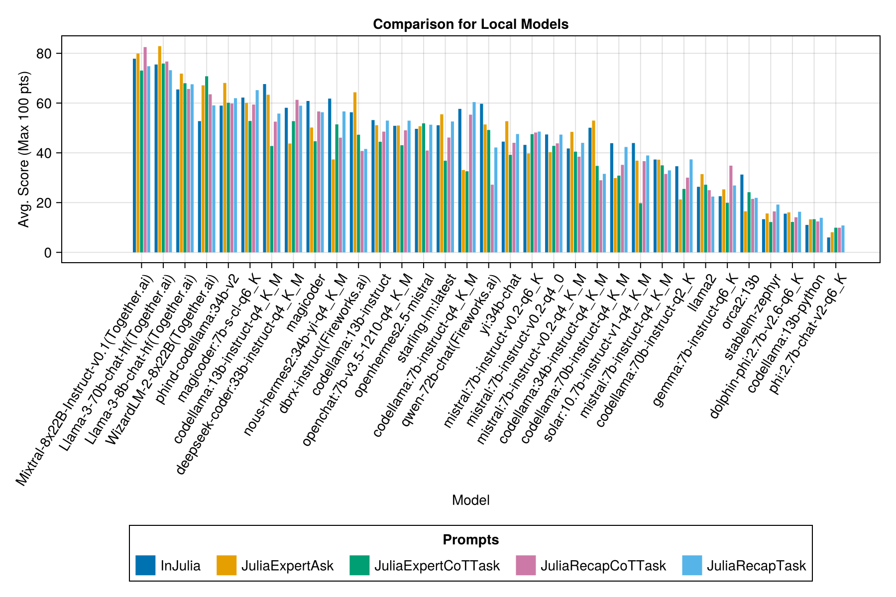
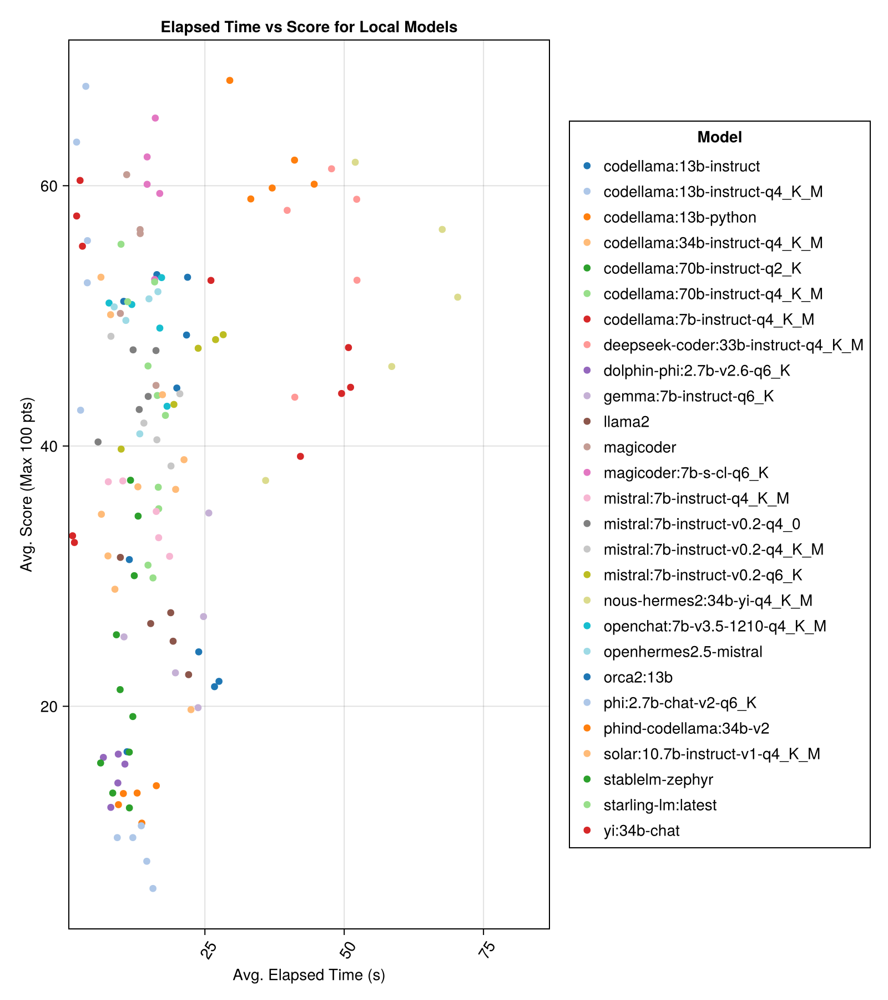

# Julia LLM Leaderboard

Comparison of Julia language generation capabilities of various Large Language Models

- [Julia LLM Leaderboard](#julia-llm-leaderboard)
  - [Introduction](#introduction)
  - [Test Cases](#test-cases)
  - [Automated Evaluation Methodology](#automated-evaluation-methodology)
  - [Results (Preview)](#results-preview)
    - [Paid APIs](#paid-apis)
    - [Local Models](#local-models)
    - [Overall Time to Run vs Score](#overall-time-to-run-vs-score)
    - [Prompting Templates](#prompting-templates)
  - [Running Evaluation / Adding More Results](#running-evaluation--adding-more-results)
  - [Debugging](#debugging)
  - [Contributing Your Test Case](#contributing-your-test-case)
    - [Anatomy of `definition.toml`](#anatomy-of-definitiontoml)
  - [Contributing GenAI Conversations with/about Julia](#contributing-genai-conversations-withabout-julia)
  - [Feedback and Improvements](#feedback-and-improvements)

## Introduction
Welcome to the Julia Code Generation Benchmark Repository! 

This project is designed for the Julia community to compare the code generation capabilities of various AI models. Unlike academic benchmarks, our focus is practicality and simplicity: "Generate code, run it, and see if it works(-ish)."

This repository aims to understand how different AI models and prompting strategies perform in generating syntactically correct Julia code to guide users in choosing the best model for their needs.

Itchy fingers? Jump to `examples/` or just run your own benchmark with `run_benchmark()` (eg, `examples/code_gen_benchmark.jl`).

## Test Cases
Test cases are defined in a `definition.toml` file, providing a standard structure for each test. If you want to contribute a test case, please follow the instructions in the [Contributing Your Test Case](#contributing-your-test-case) section.

## Automated Evaluation Methodology
Each model's and prompt's performance is evaluated based on several criteria:
1. **Parsing**: Does the generated code parse correctly in Julia?
2. **Execution**: Can the code execute without errors?
3. **Unit Tests**: Do the included unit tests pass?
4. **Example Runs**: Does the code run in a provided example scenario?

At the moment, all criteria are weighed equally and each test case can earn a maximum of 100 points. If a code passes all criteria, it gets 100/100 points. If it fails one criterion (eg, all unit tests), it gets 75/100 points. If it fails two criteria (eg, it runs but all examples and unit tests are broken), it gets 50 points, and so on.

## Results (Preview)
To provide a glimpse of the repository's functionality, we have included example results for the first 14 test cases. [**Open the documentation**](https://svilupp.github.io/Julia-LLM-Leaderboard/dev/) for the full results and a deep dive on each test case.

> [!WARNING]  
> These scores might change as we evolve the supporting functionality and add more models.

Remember that the benchmark is quite challenging for any model - a single extra space or parentheses and the score might become 0 (="unable to parse")!

### Paid APIs

Across the board, Claude 3 and GPT-4 are the best-performing models. The real surprise is the performance of Claude 3 Haiku which is 50-100x cheaper than Claude 3 Opus but still beats GPT-4.
The latest GPT3.5-Turbo (0125) scores very well - in many cases, it's as good as GPT-4 Turbo, yet it's much cheaper and faster (see the deep-dive in the docs)!
"mistral-small" ("Mixtral 8x7B" model) is quite impressive, as it beats many of the GPT-3.5 Turbo in many cases.

| Model                    | Elapsed | Score | Score Std Deviation | Count Zero Score | Count Full Score | Cost Cents |
|--------------------------|---------|-------|---------------------|------------------|------------------|------------|
|   claude-3-opus-20240229 |    20.3 |  83.2 |                19.6 |                2 |              329 |        3.9 |
| claude-3-sonnet-20240229 |     8.7 |  78.8 |                26.2 |               22 |              308 |       0.73 |
|   gpt-4-turbo-2024-04-09 |    10.8 |  75.3 |                29.6 |               38 |              290 |       1.38 |
|  claude-3-haiku-20240307 |     4.0 |  74.9 |                27.2 |                9 |              261 |       0.05 |
|       gpt-4-0125-preview |    30.3 |  74.4 |                30.3 |               39 |              284 |       1.29 |
|       gpt-4-1106-preview |    22.4 |  74.4 |                29.9 |               19 |              142 |       1.21 |
|       mistral-large-2402 |     8.5 |  71.6 |                27.2 |               13 |              223 |        0.0 |
|               claude-2.1 |    10.1 |  67.9 |                30.8 |               47 |              229 |        0.8 |
|       gpt-3.5-turbo-0125 |     1.2 |  61.7 |                36.6 |              125 |              192 |       0.03 |
|           mistral-medium |    18.1 |  60.8 |                33.2 |               22 |               90 |       0.41 |
|            mistral-small |     5.9 |  60.1 |                30.2 |               27 |               76 |       0.09 |
|       mistral-small-2402 |     5.3 |  59.9 |                29.4 |               31 |              169 |        0.0 |
|       gpt-3.5-turbo-1106 |     2.1 |  58.4 |                39.2 |               82 |               97 |       0.04 |
|             mistral-tiny |     4.6 |  46.9 |                32.0 |               75 |               42 |       0.02 |
|            gpt-3.5-turbo |     3.6 |  42.3 |                38.2 |              132 |               54 |       0.04 |
|    gemini-1.0-pro-latest |     4.2 |  34.8 |                27.4 |              181 |               25 |        0.0 |

Note: From mid-February 2024, "gpt-3.5-turbo" will point to the latest release, "gpt-3.5-turbo-0125" (deprecating the June release).

Same information, but as a bar chart:

In addition, we can consider the performance (score) versus the cost (measured in US cents):

### Local Models

Locally-hosted models are generally not as good as the best paid APIs, but they are getting close! Note that the "mistral-small" is already available to be run locally and there will be many future finetunes!

> [!NOTE]
> Big thank you to [01.ai](https://github.com/01-ai) and Jun Tian in particular for providing the compute for several parts of this benchmark!

The best-performing models are in general around 33/34Bn parameters - Phind CodeLlama and Deepseek Coder, however, magicoder:7b (Q6_K!) and codellama:13b (Q4_K_M!) give them a run for their money.

| Model                              | Elapsed | Elapsed Median | Score | Score Median | Score Std Deviation | Count Zero Score | Count Full Score |
|------------------------------------|---------|----------------|-------|--------------|---------------------|------------------|------------------|
|             phind-codellama:34b-v2 |    37.1 |           36.4 |  61.8 |         62.5 |                33.5 |             36.0 |             58.0 |
|             magicoder:7b-s-cl-q6_K |    15.6 |           15.8 |  59.9 |         60.0 |                29.9 |             18.0 |             35.0 |
|      codellama:13b-instruct-q4_K_M |     3.2 |            3.0 |  56.4 |         54.6 |                33.0 |             56.0 |             61.0 |
| deepseek-coder:33b-instruct-q4_K_M |    46.7 |           44.6 |  55.0 |         50.0 |                36.8 |             62.0 |             68.0 |
|                          magicoder |    12.8 |           10.7 |  53.7 |         50.0 |                33.2 |             49.0 |             52.0 |
|         nous-hermes2:34b-yi-q4_K_M |    56.8 |           52.8 |  50.7 |         50.0 |                34.7 |             78.0 |             56.0 |
|             codellama:13b-instruct |    18.1 |           16.7 |  50.0 |         50.0 |                34.4 |             65.0 |             44.0 |
|       openchat:7b-v3.5-1210-q4_K_M |    14.4 |           13.7 |  49.4 |         50.0 |                30.3 |             48.0 |             23.0 |
|              openhermes2.5-mistral |    12.9 |           12.2 |  48.9 |         50.0 |                31.3 |             55.0 |             27.0 |
|                 starling-lm:latest |    13.7 |           12.5 |  48.4 |         50.0 |                30.2 |             58.0 |             26.0 |
|       codellama:7b-instruct-q4_K_M |     2.1 |            2.0 |  47.8 |         50.0 |                35.3 |             95.0 |             38.0 |
|                        yi:34b-chat |    43.9 |           41.3 |  45.6 |         50.0 |                30.5 |             45.0 |             34.0 |
|      mistral:7b-instruct-v0.2-q6_K |    21.7 |           20.9 |  45.4 |         50.0 |                31.3 |             44.0 |             23.0 |
|      mistral:7b-instruct-v0.2-q4_0 |    12.4 |           12.3 |  44.3 |         50.0 |                30.6 |             75.0 |             32.0 |
|    mistral:7b-instruct-v0.2-q4_K_M |    15.6 |           15.1 |  42.6 |         50.0 |                28.6 |             71.0 |             23.0 |
|      codellama:34b-instruct-q4_K_M |     7.5 |            6.8 |  39.7 |         50.0 |                36.1 |            127.0 |             35.0 |
|      codellama:70b-instruct-q4_K_M |    16.3 |           13.8 |  36.4 |          0.0 |                41.2 |            179.0 |             58.0 |
|     solar:10.7b-instruct-v1-q4_K_M |    18.8 |           17.7 |  35.2 |         50.0 |                31.1 |            107.0 |             10.0 |
|         mistral:7b-instruct-q4_K_M |    13.9 |           13.0 |  34.8 |         50.0 |                26.5 |             80.0 |              0.0 |
|        codellama:70b-instruct-q2_K |    11.2 |            9.4 |  29.8 |          0.0 |                37.7 |            198.0 |             29.0 |
|                             llama2 |    17.1 |           16.3 |  26.5 |         25.0 |                26.5 |            131.0 |              0.0 |
|             gemma:7b-instruct-q6_K |    20.9 |           22.1 |  25.9 |         25.0 |                25.2 |            147.0 |              2.0 |
|                          orca2:13b |    20.1 |           18.3 |  23.1 |          0.0 |                30.6 |            166.0 |             11.0 |
|                    stablelm-zephyr |     9.9 |            7.7 |  15.4 |          0.0 |                23.5 |            192.0 |              1.0 |
|         dolphin-phi:2.7b-v2.6-q6_K |     8.9 |            8.4 |  14.9 |          0.0 |                22.9 |            188.0 |              0.0 |
|               codellama:13b-python |    12.5 |           10.7 |  12.8 |          0.0 |                22.1 |            155.0 |              0.0 |
|              phi:2.7b-chat-v2-q6_K |    13.0 |           11.6 |   8.9 |          0.0 |                19.4 |            222.0 |              0.0 |

Same information, but as a bar chart:

And with a separate bar for each prompt template:

> [!NOTE]
> Qwen-1.5 models have been removed from the overviews as the underlying model on Ollama repository (and HF) is not correct and has very low performance.

> [!NOTE]
> I have noticed that some evals in Ollama/llama.cpp now score slightly higher now than in Dec-23, so it's on a roadmap to re-run the above evals.

### Overall Time to Run vs Score

Clearly, the paid APIs win (the latest release: GPT-3.5-Turbo-1106), but that's not the whole story.

### Prompting Templates

We hope to be able to provide some guidance around prompting strategies, eg, when is it better to use a "JuliaExpert*" prompt template vs an "In Julia, answer XYZ" prompt.

Learnings so far: 

- Never use the "AsIs" prompt (ie, raw task definition). ALWAYS add some context around the language, situation, etc.
- Even a simple "In Julia, answer XYZ" prompt can be quite effective. Note that the bigger prompts ("CoT" stands for Chain of Thought) might be confusing the smaller models, hence why this prompt is so effective on average.

| Prompt Template    | Elapsed (s, average) | Elapsed (s, median) | Avg. Score (Max 100 pts) | Median Score (Max 100 pts) |
|--------------------|----------------------|---------------------|--------------------------|----------------------------|
|            InJulia |                 14.3 |                10.1 |                     53.9 |                       50.0 |
|     JuliaExpertAsk |                  9.9 |                 6.7 |                     51.3 |                       50.0 |
|     JuliaRecapTask |                 17.3 |                12.4 |                     50.6 |                       50.0 |
| JuliaExpertCoTTask |                 15.7 |                11.0 |                     47.4 |                       50.0 |
|  JuliaRecapCoTTask |                 16.6 |                11.9 |                     46.5 |                       50.0 |

Note: The XML-based templates are tested only for Claude 3 models (Haiku and Sonnet), that's why we remove them from the comparison.

Make your own analysis with `examples/summarize_results.jl`!

## Running Evaluation / Adding More Results
1. **Existing Evaluations**: Check `scripts/code_gen_benchmark.jl` for the example of previous evaluations.
2. **Run Your Evaluation**: Choose your model and prompt, and run the test.
3. **Save Results**: Store both the conversation and the evaluation.
4. **Open a PR**: Include the part of the code snippet you changed in the PR comments. We generally require 1-2 independent verifications of your result.

Want to run some experiments and save the results? Check out `examples/experiment_hyperparameter_scan.jl`!

## Debugging

Want to review some of the past benchmark runs? Check out `examples/summarize_results.jl` for overall statistics and `examples/debugging_results.jl` for reviewing the individual conversations/model responses.

## Contributing Your Test Case
To contribute a test case:

1. **Naming Convention**: Create nested folders following the format `code_generation/category/test_case_name/definition.toml`.
2. **Saving Results**: Store the full conversation and the evaluation results in a path nested by a model name like `code_generation/category/test case/model/evaluation__PROMPT__STRATEGY__TIMESTAMP.json` and `code_generation/category/test case/model/conversation__PROMPT__STRATEGY__TIMESTAMP.json`

### Anatomy of `definition.toml`
Required fields in `definition.toml` include:
- **name**: Corresponding to the file path.
- **contributor**: The creator of the test case (and their collaborators).
- **criteria**: The evaluation criteria (eg, parsing, execution, unit_tests, examples).
- **prompt**: The problem statement or task.
- **version**: The version of the test case. Starts at "1.0".
- **examples**: Example scenarios for testing, provided as a vector of executable statements using the function name (eg, `my_function(1, 2)`).
- **unit_tests**: Tests to validate the code, provided as a vector of `@test X = Z` statements.
- **imports**: Packages that are made available to the model (to avoid failures due to a failed dependency).
- **reference_solution**: A reference solution to the problem, provided as a string of Julia code (no code fences).

There are several optional fields:
- **examples_setup**: Code to run before each example eval, provided as a string of Julia code (no code fences). Used to setup any variables or functions needed for the examples.
- **examples_teardown**: Code to run after each example eval, provided as a string of Julia code (no code fences). Used to clean up any variables or functions needed for the examples.
- **unit_tests_setup**: Code to run before each unit test eval, provided as a string of Julia code (no code fences). Used to setup any variables or functions needed for the unit tests.
- **unit_tests_teardown**: Code to run after each unit test eval, provided as a string of Julia code (no code fences). Used to clean up any variables or functions needed for the unit tests.

The above fields can improve re-use of code across the examples/unit tests.

See an example in `examples/create_definition.jl`. 
You can validate your test case definitions with `validate_definition()`.

## Contributing GenAI Conversations with/about Julia

Please PR and add any relevant and MOSTLY CORRECT conversations with/in/about Julia in folder `julia_conversations/`. 

The goal is to have a collection of conversations that are useful for finetuning Julia knowledge in smaller models.

## Feedback and Improvements
We highly value community input. If you have suggestions or ideas for improvement, please open an issue. All contributions are welcome!