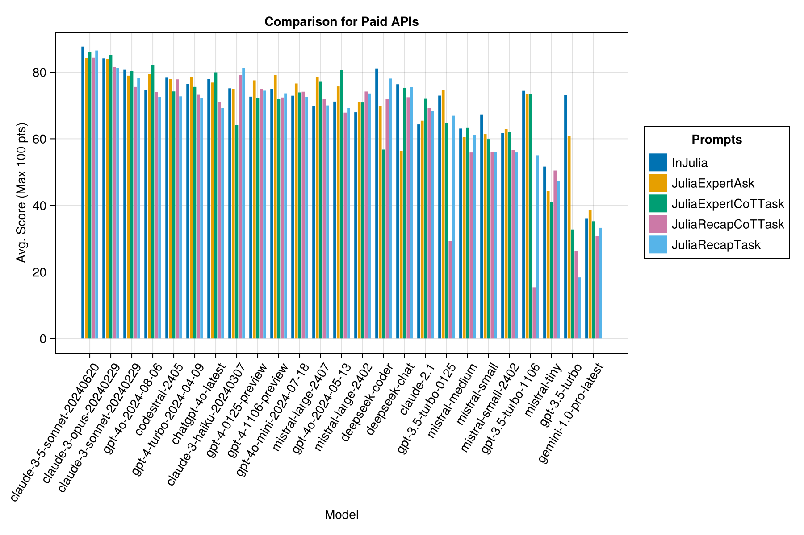
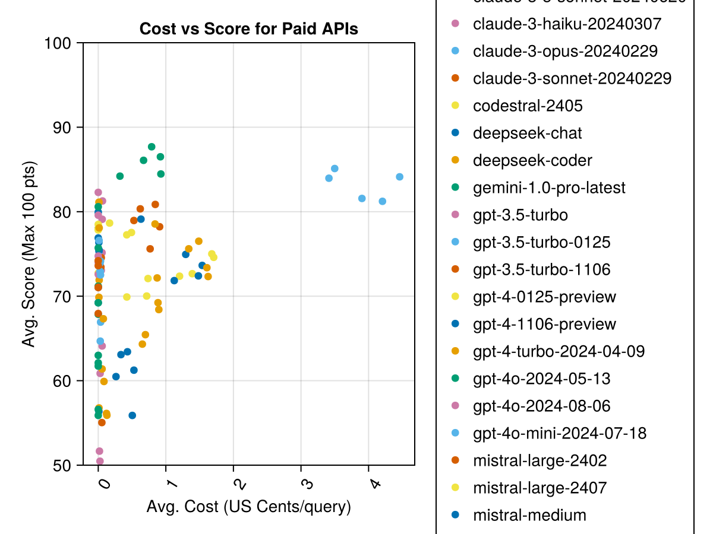
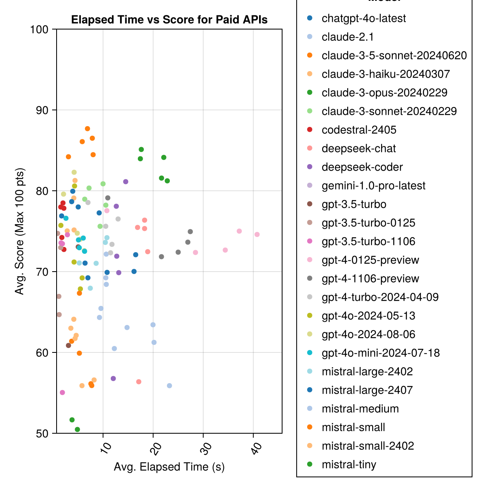

# Julia LLM Leaderboard

Comparison of Julia language generation capabilities of various Large Language Models

- [Julia LLM Leaderboard](#julia-llm-leaderboard)
  - [Introduction](#introduction)
  - [Test Cases](#test-cases)
  - [Automated Evaluation Methodology](#automated-evaluation-methodology)
  - [Results (Preview)](#results-preview)
    - [Paid APIs](#paid-apis)
    - [OSS Models](#oss-models)
    - [Overall Time to Run vs Score](#overall-time-to-run-vs-score)
    - [Prompting Templates](#prompting-templates)
  - [Running Evaluation / Adding More Results](#running-evaluation--adding-more-results)
  - [Debugging](#debugging)
  - [Contributing Your Test Case](#contributing-your-test-case)
    - [Anatomy of `definition.toml`](#anatomy-of-definitiontoml)
  - [Feedback and Improvements](#feedback-and-improvements)

## Introduction
Welcome to the Julia Code Generation Benchmark Repository! 

This project is designed for the Julia community to compare the code generation capabilities of various AI models. Unlike academic benchmarks, our focus is practicality and simplicity: "Generate code, run it, and see if it works(-ish)."

This repository aims to understand how different AI models and prompting strategies perform in generating syntactically correct Julia code to guide users in choosing the best model for their needs.

Itchy fingers? Jump to `examples/` or just run your own benchmark with `run_benchmark()` (eg, `examples/code_gen_benchmark.jl`).

## Test Cases
Test cases are defined in a `definition.toml` file, providing a standard structure for each test. If you want to contribute a test case, please follow the instructions in the [Contributing Your Test Case](#contributing-your-test-case) section.

## Automated Evaluation Methodology
Each model's and prompt's performance is evaluated based on several criteria:
1. **Parsing**: Does the generated code parse correctly in Julia?
2. **Execution**: Can the code execute without errors?
3. **Unit Tests**: Do the included unit tests pass?
4. **Example Runs**: Does the code run in a provided example scenario?

At the moment, all criteria are weighed equally and each test case can earn a maximum of 100 points. If a code passes all criteria, it gets 100/100 points. If it fails one criterion (eg, all unit tests), it gets 75/100 points. If it fails two criteria (eg, it runs but all examples and unit tests are broken), it gets 50 points, and so on.

## Results (Preview)
To provide a glimpse of the repository's functionality, we have included example results for the first 14 test cases. Open the documentation for the full results and a deep dive on each test case.

> [!WARNING]  
> These scores might change as we evolve the supporting functionality and add more models.

Remember that the benchmark is quite challenging for any model - a single extra space or parentheses and the score might become 0 (="unable to parse")!

### Paid APIs

Across the board, GPT-4 tends to be among the best-performing models. However, "mistral-small" (the recently released "Mixtral 8x7B" model) is quite impressive and it beats the default GPT-3.5 Turbo model in most cases.

| model              | InJulia | JuliaExpertAsk | JuliaExpertCoTTask | JuliaRecapCoTTask | JuliaRecapTask | AverageScore |
|--------------------|---------|----------------|--------------------|-------------------|----------------|--------------|
| gpt-4-1106-preview |    77.5 |           76.7 |               74.3 |              77.6 |           72.9 |         75.8 |
|     mistral-medium |    66.6 |           70.0 |               68.9 |              61.0 |           65.6 |         66.4 |
|      mistral-small |    69.6 |           64.2 |               61.1 |              57.1 |           58.0 |         62.0 |
| gpt-3.5-turbo-1106 |    76.7 |           74.6 |               73.8 |              15.9 |           56.5 |         59.5 |
|       mistral-tiny |    54.8 |           46.2 |               41.9 |              52.2 |           46.6 |         48.3 |
|      gpt-3.5-turbo |    72.8 |           61.4 |               33.0 |              26.4 |           16.8 |         42.1 |

Same information, but as a bar chart:

In addition, we can consider the performance (score) versus the cost (measured in US cents):

### OSS Models

Open-source models are generally not as good as the best paid APIs, but they are getting close! Note that the "mistral-small" is already available to be run locally and there will be many future finetunes!

The best-performing models are in general around 33/34Bn parameters - Phind CodeLlama and Deepseek Coder, however, they get defeated by a 7Bn Magicoder (if we use Q6 quantization).

| Model                              | Elapsed | Elapsed Median | Score | Score Median | Score Std Deviation | Count Zero Score | Count Full Score |
|------------------------------------|---------|----------------|-------|--------------|---------------------|------------------|------------------|
|             magicoder:7b-s-cl-q6_K |    15.6 |           15.6 |  61.9 |         60.0 |                28.7 |             11.0 |             35.0 |
|             phind-codellama:34b-v2 |    37.1 |           37.1 |  61.2 |         72.5 |                33.1 |             28.0 |             50.0 |
|                          magicoder |    12.8 |           12.8 |  53.7 |         50.0 |                32.8 |             41.0 |             51.0 |
| deepseek-coder:33b-instruct-q4_K_M |    46.7 |           46.7 |  53.4 |         50.0 |                37.0 |             48.0 |             69.0 |
|         nous-hermes2:34b-yi-q4_K_M |    56.8 |           56.8 |  50.8 |         50.0 |                32.9 |             65.0 |             47.0 |
|             codellama:13b-instruct |    18.1 |           18.1 |  50.5 |         50.0 |                33.2 |             52.0 |             42.0 |
|              openhermes2.5-mistral |    12.9 |           12.9 |  50.4 |         50.0 |                29.3 |             35.0 |             26.0 |
|                 starling-lm:latest |    13.7 |           13.7 |  50.0 |         50.0 |                26.8 |             27.0 |             23.0 |
|       openchat:7b-v3.5-1210-q4_K_M |    14.4 |           14.4 |  47.7 |         50.0 |                29.7 |             35.0 |             22.0 |
|                        yi:34b-chat |    43.9 |           43.9 |  46.3 |         50.0 |                30.1 |             35.0 |             34.0 |
|      mistral:7b-instruct-v0.2-q4_0 |    12.4 |           12.4 |  45.8 |         50.0 |                28.6 |             52.0 |             30.0 |
|      mistral:7b-instruct-v0.2-q6_K |    21.7 |           21.7 |  45.7 |         50.0 |                28.8 |             31.0 |             19.0 |
|    mistral:7b-instruct-v0.2-q4_K_M |    15.6 |           15.6 |  44.6 |         50.0 |                26.0 |             47.0 |             19.0 |
|     solar:10.7b-instruct-v1-q4_K_M |    18.8 |           18.8 |  32.7 |         25.0 |                27.8 |             79.0 |              8.0 |
|         mistral:7b-instruct-q4_K_M |    13.9 |           13.9 |  32.3 |         25.0 |                24.0 |             60.0 |              0.0 |
|                             llama2 |    17.1 |           17.1 |  28.3 |         25.0 |                23.9 |             93.0 |              0.0 |
|                          orca2:13b |    20.1 |           20.1 |  23.8 |          0.0 |                28.7 |            145.0 |              8.0 |
|                    stablelm-zephyr |     9.9 |            9.9 |  21.3 |         25.0 |                22.0 |            125.0 |              1.0 |
|         dolphin-phi:2.7b-v2.6-q6_K |     8.9 |            8.9 |  18.1 |          0.0 |                22.5 |            154.0 |              0.0 |
|               codellama:13b-python |    12.5 |           12.5 |  13.8 |          0.0 |                21.1 |            140.0 |              0.0 |
|              phi:2.7b-chat-v2-q6_K |    13.0 |           13.0 |   8.0 |          0.0 |                13.6 |            197.0 |              0.0 |

Same information, but as a bar chart:

And with a separate bar for each prompt template:

### Overall Time to Run vs Score

Clearly, the paid APIs win (the latest release: GPT-3.5-Turbo-1106), but that's not the whole story.

### Prompting Templates

We hope to be able to provide some guidance around prompting strategies, eg, when is it better to use a "JuliaExpert*" prompt template vs an "In Julia, answer XYZ" prompt.

Learnings so far: 

- Never use the "AsIs" prompt (ie, raw task definition). ALWAYS add some context around the language, situation, etc.
- Even a simple "In Julia, answer XYZ" prompt can be quite effective. Note that the bigger prompts ("CoT" stands for Chain of Thought) might be confusing the smaller models, hence why this prompt is so effective on average.

| Prompt Template    | Elapsed (s, average) | Elapsed (s, median) | Avg. Score (Max 100 pts) | Median Score (Max 100 pts) |
|--------------------|----------------------|---------------------|--------------------------|----------------------------|
|            InJulia |                 16.7 |                11.7 |                     50.6 |                       50.0 |
|     JuliaExpertAsk |                 11.8 |                 7.8 |                     47.6 |                       50.0 |
|     JuliaRecapTask |                 20.9 |                15.9 |                     45.6 |                       50.0 |
| JuliaExpertCoTTask |                 19.7 |                14.9 |                     43.9 |                       50.0 |
|  JuliaRecapCoTTask |                 19.7 |                15.2 |                     42.5 |                       50.0 |
|               AsIs |                 36.3 |                11.2 |                     13.0 |                        0.0 |

Make your own analysis with `examples/summarize_results.jl`!

## Running Evaluation / Adding More Results
1. **Existing Evaluations**: Check `scripts/code_gen_benchmark.jl` for the example of previous evaluations.
2. **Run Your Evaluation**: Choose your model and prompt, and run the test.
3. **Save Results**: Store both the conversation and the evaluation.
4. **Open a PR**: Include the part of the code snippet you changed in the PR comments. We generally require 1-2 independent verifications of your result.

Want to run some experiments and save the results? Check out `examples/experiment_hyperparameter_scan.jl`!

## Debugging

Want to review some of the past benchmark runs? Check out `examples/summarize_results.jl` for overall statistics and `examples/debugging_results.jl` for reviewing the individual conversations/model responses.

## Contributing Your Test Case
To contribute a test case:

1. **Naming Convention**: Create nested folders following the format `code_generation/category/test_case_name/definition.toml`.
2. **Saving Results**: Store the full conversation and the evaluation results in a path nested by a model name like `code_generation/category/test case/model/evaluation__PROMPT__STRATEGY__TIMESTAMP.json` and `code_generation/category/test case/model/conversation__PROMPT__STRATEGY__TIMESTAMP.json`

### Anatomy of `definition.toml`
Required fields in `definition.toml` include:
- **name**: Corresponding to the file path.
- **contributor**: The creator of the test case (and their collaborators).
- **criteria**: The evaluation criteria (eg, parsing, execution, unit_tests, examples).
- **prompt**: The problem statement or task.
- **version**: The version of the test case. Starts at "1.0".
- **examples**: Example scenarios for testing, provided as a vector of executable statements using the function name (eg, `my_function(1, 2)`).
- **unit_tests**: Tests to validate the code, provided as a vector of `@test X = Z` statements.
- **imports**: Packages that are made available to the model (to avoid failures due to a failed dependency).
- **reference_solution**: A reference solution to the problem, provided as a string of Julia code (no code fences).

There are several optional fields:
- **examples_setup**: Code to run before each example eval, provided as a string of Julia code (no code fences). Used to setup any variables or functions needed for the examples.
- **examples_teardown**: Code to run after each example eval, provided as a string of Julia code (no code fences). Used to clean up any variables or functions needed for the examples.
- **unit_tests_setup**: Code to run before each unit test eval, provided as a string of Julia code (no code fences). Used to setup any variables or functions needed for the unit tests.
- **unit_tests_teardown**: Code to run after each unit test eval, provided as a string of Julia code (no code fences). Used to clean up any variables or functions needed for the unit tests.

The above fields can improve re-use of code across the examples/unit tests.

See an example in `examples/create_definition.jl`. 
You can validate your test case definitions with `validate_definition()`.

## Feedback and Improvements
We highly value community input. If you have suggestions or ideas for improvement, please open an issue. All contributions are welcome!