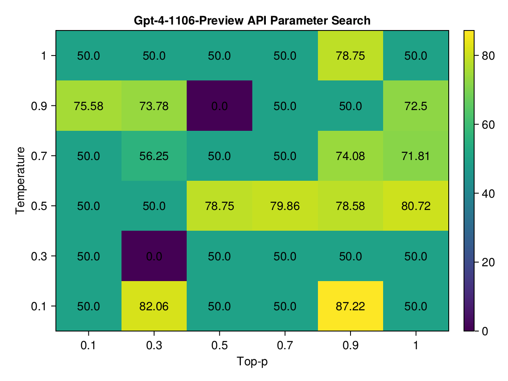
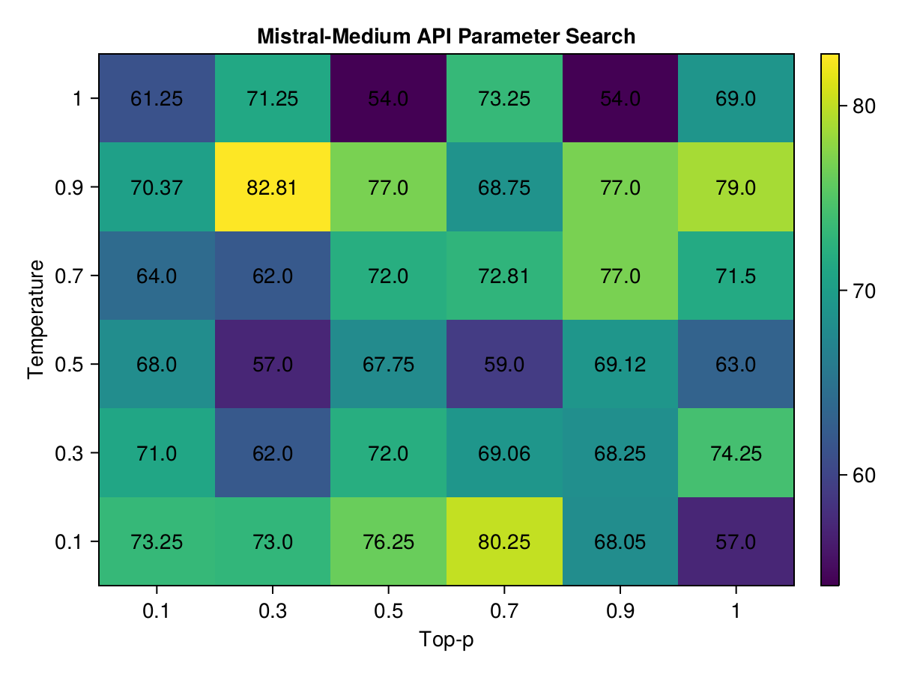
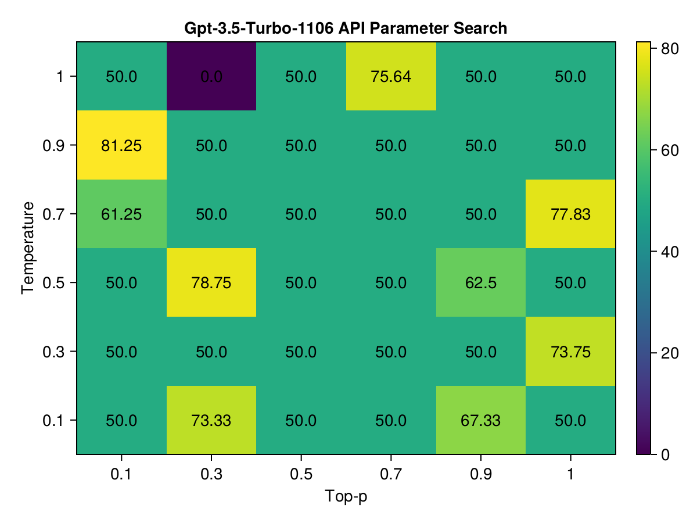
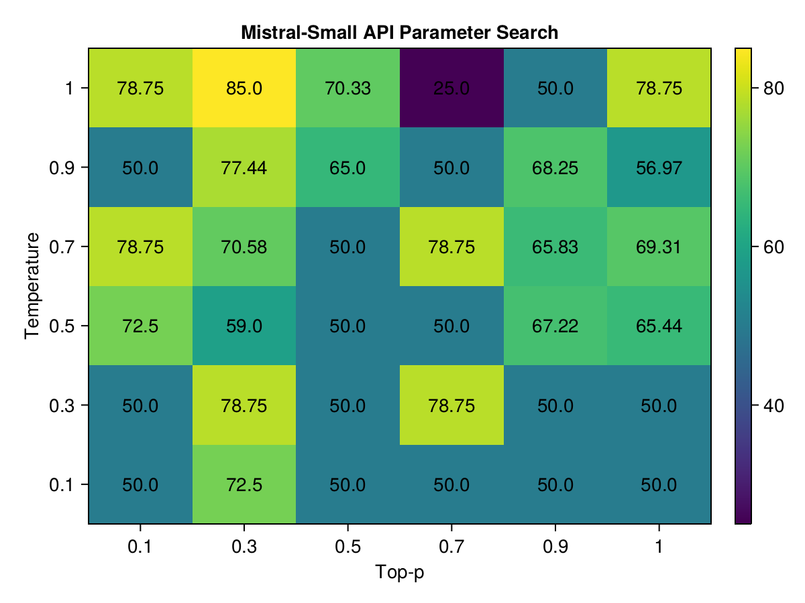
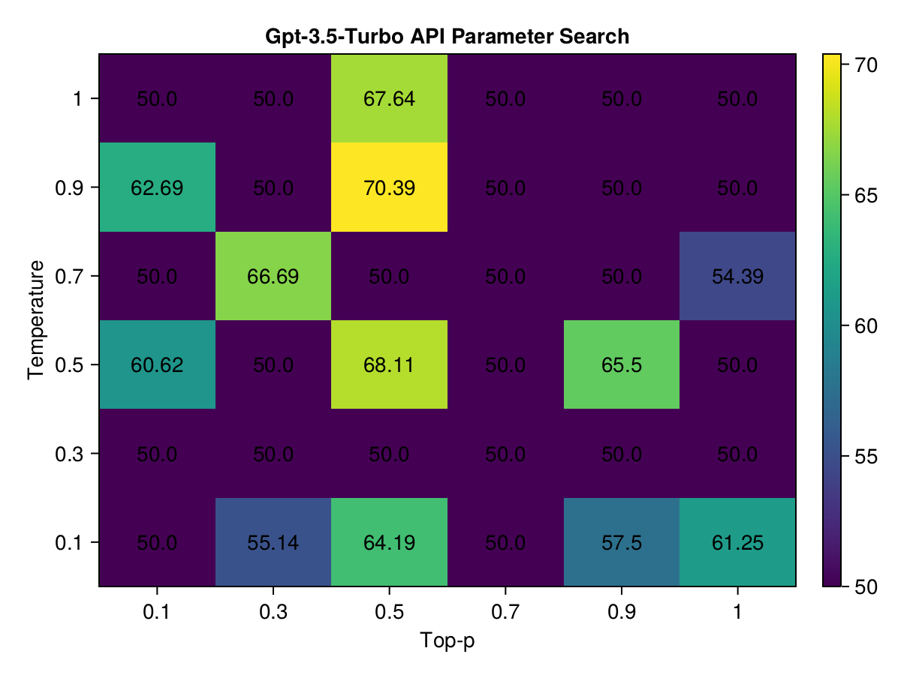
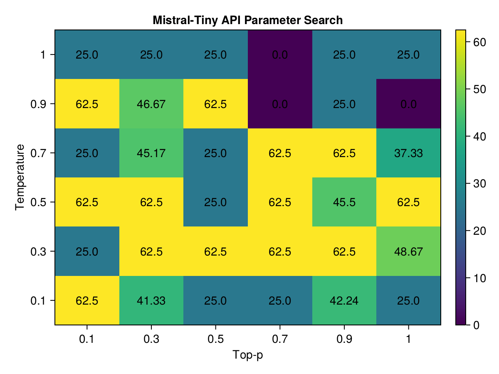

# Experiment to determine optimal Temperature and Top-p for Code Generation

# Methodology

**Simple staged search:**
- Stage 1 - grid search
  - pick the hardest test case: `extract_julia_code` and the default template `JuliaExpertAsk`
  - run grid search for `temperature` and `top_p` for each model (36 hyperparameters)
- Stage 2 - increase sample size for the most promising hyperparameters
  - pick the top ~5-10 highest-scoring hyperparameters (keep the values from the original grid)
  - run evaluation for all test cases (14 problems) and the default template `JuliaExpertAsk`
- Stage 3 - run the full benchmark <done outside of the experiments folder>
  - run the full benchmark for the best hyperparameters for each model

Note: I improved the code parsing to accommodate smaller models (eg, imprecise markdown code fences but having a valid code, valid function definition but an invalid follow-on explanation that breaks the execution), which meant that scores moved slightly after the experiment. However, the winning combinations remained the same.

# Overall Results (across all hparams)

| Model              | Avg. Score | # of Zero Scores | Count |
|--------------------|------------|------------------|-------|
| gpt-4-1106-preview |       73.4 |              4.0 | 162.0 |
|     mistral-medium |       70.0 |              4.0 | 272.0 |
| gpt-3.5-turbo-1106 |       67.4 |              3.0 | 120.0 |
|      mistral-small |       65.8 |              2.0 | 190.0 |
|      gpt-3.5-turbo |       61.3 |              6.0 | 191.0 |
|       mistral-tiny |       42.8 |             28.0 | 148.0 |

# Individual Results

**Emerging insights (Temperature / top_p):**
- mistral-medium: 0.9/0.3
- mistral-small: 1.0/0.3
- mistral-tiny: ---
- gpt-4-1106-preview: 0.1/0.9
- gpt-3.5-turbo-1106: 0.9/0.1
- gpt-3.5-turbo: 0.5/0.5 (not strictly highest, but keeps sum as =1)

## Top 3 Combinations for gpt-4-1106-preview

| Temperature | Top P | Score             | Count Zeros | Count |
|-------------|-------|-------------------|-------------|-------|
|         0.1 |   0.9 | 87.22222222222221 |           0 |    15 |
|         0.1 |   0.3 | 82.05555555555556 |           0 |    15 |
|         0.5 |     1 | 80.72222222222221 |           0 |    15 |

## Top 3 Combinations for mistral-medium

| Temperature | Top P | Score             | Count Zeros | Count |
|-------------|-------|-------------------|-------------|-------|
|         0.9 |   0.3 | 82.80555555555557 |           0 |    15 |
|         0.1 |   0.7 |             80.25 |           0 |     5 |
|         0.9 |     1 |              79.0 |           0 |     5 |

## Top 3 Combinations for gpt-3.5-turbo-1106

| Temperature | Top P | Score             | Count Zeros | Count |
|-------------|-------|-------------------|-------------|-------|
|         0.9 |   0.1 | 81.24999999999999 |           0 |    15 |
|         0.5 |   0.3 |             78.75 |           0 |     1 |
|         0.7 |     1 | 77.83333333333333 |           1 |    15 |

## Top 3 Combinations for mistral-small

Note: Due to the evaluation parser improvements, the scores for the mistral-small model have changed slightly. 
The highest scoring combination with sufficient sample size is still 0.9/0.3 (same as mistral-medium), the highest value in the heatmap (85.0) does not have sufficient sample size (only 1 run).

| Temperature | Top P | Score | Count Zeros | Count |
|-------------|-------|-------|-------------|-------|
|           1 |   0.3 |  85.0 |           0 |     1 |
|         0.3 |   0.3 | 78.75 |           0 |     1 |
|         0.3 |   0.7 | 78.75 |           0 |     1 |

## Top 3 Combinations for gpt-3.5-turbo

| Temperature | Top P | Score             | Count Zeros | Count |
|-------------|-------|-------------------|-------------|-------|
|         0.9 |   0.5 | 70.38888888888889 |           0 |    15 |
|         0.5 |   0.5 | 68.11111111111111 |           0 |    15 |
|           1 |   0.5 | 67.63888888888889 |           0 |    15 |

## Top 3 Combinations for mistral-tiny

All the re-sampled combinations from Stage 2 drop off this table to performance ~0.5. Ie, no need to keep re-sampling the "top" combinations, they are just a noise/lucky shot.

| Temperature | Top P | Score | Count Zeros | Count |
|-------------|-------|-------|-------------|-------|
|         0.1 |   0.1 |  62.5 |           0 |     1 |
|         0.3 |   0.3 |  62.5 |           0 |     1 |
|         0.3 |   0.5 |  62.5 |           0 |     1 |

