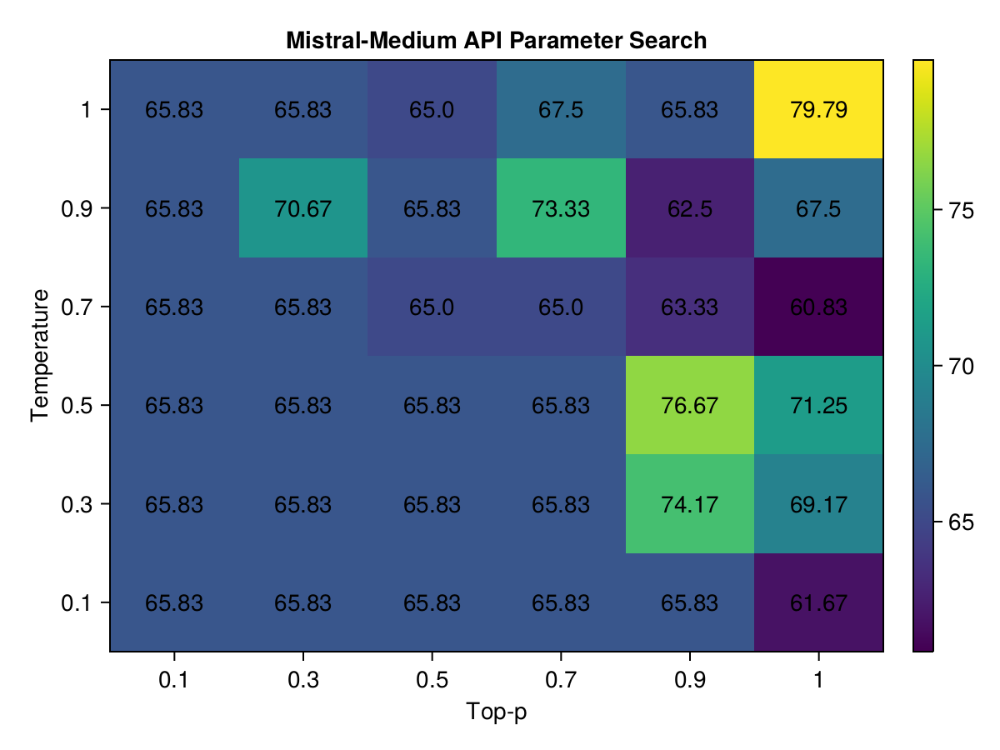

# Re-Run of Hyperparameter Search To Validate Mistral-Medium

Re-running the same search the next day, because the previously found hyperparameters made little to no difference. I suspect something has changed.

Note: I improved the code parsing to accommodate smaller models (eg, imprecise markdown code fences but having a valid code, valid function definition but an invalid follow-on explanation that breaks the execution), which meant that scores moved slightly after the experiment. However, the winning combinations remained the same.

# Results From Previous Day

Overall: 

| Model          | Avg. Score | # of Zero Scores | Count |
|----------------|------------|------------------|-------|
| mistral-medium |       70.0 |              4.0 | 272.0 |

Breakdown by test case:

| Model          | Name                  | Avg. Score | # of Zero Scores | Count |
|----------------|-----------------------|------------|------------------|-------|
| mistral-medium |        FloatWithUnits |      100.0 |              0.0 |   8.0 |
| mistral-medium |       timezone_bumper |      100.0 |              0.0 |   8.0 |
| mistral-medium |      count_model_rows |       96.4 |              0.0 |  39.0 |
| mistral-medium |          clean_column |       84.4 |              1.0 |   8.0 |
| mistral-medium |           wrap_string |       82.8 |              0.0 |   8.0 |
| mistral-medium |    extract_julia_code |       80.6 |              0.0 |  44.0 |
| mistral-medium | weather_data_analyzer |       79.0 |              2.0 |  39.0 |
| mistral-medium |     q_and_a_extractor |       66.7 |              0.0 |   8.0 |
| mistral-medium |       event_scheduler |       65.0 |              0.0 |   8.0 |
| mistral-medium |          pig_latinify |       57.5 |              0.0 |   8.0 |
| mistral-medium |       keep_only_names |       56.9 |              0.0 |   8.0 |
| mistral-medium |         add_yearmonth |       52.4 |              1.0 |  39.0 |
| mistral-medium |            ispersonal |       37.5 |              0.0 |   8.0 |
| mistral-medium |           audi_filter |       35.9 |              0.0 |  39.0 |

## Top 3 Combinations for mistral-medium

| Temperature | Top P | Score             | Count Zeros | Count |
|-------------|-------|-------------------|-------------|-------|
|         0.9 |   0.3 | 82.80555555555557 |           0 |    15 |
|         0.1 |   0.7 |             80.25 |           0 |     5 |
|         0.9 |     1 |              79.0 |           0 |     5 |

## Heatmap:

# Results From Re-Run

Overall:

| Model          | Avg. Score | # of Zero Scores | Count |
|----------------|------------|------------------|-------|
| mistral-medium |       67.2 |              0.0 | 230.0 |

Breakdown by test case:

| Model          | Name                  | Avg. Score | # of Zero Scores | Count |
|----------------|-----------------------|------------|------------------|-------|
| mistral-medium |        FloatWithUnits |      100.0 |              0.0 |   1.0 |
| mistral-medium |          clean_column |      100.0 |              0.0 |   1.0 |
| mistral-medium |       timezone_bumper |      100.0 |              0.0 |   1.0 |
| mistral-medium |      count_model_rows |       98.6 |              0.0 |  37.0 |
| mistral-medium | weather_data_analyzer |       93.1 |              0.0 |  37.0 |
| mistral-medium |           wrap_string |       87.5 |              0.0 |   1.0 |
| mistral-medium |     q_and_a_extractor |       73.3 |              0.0 |   1.0 |
| mistral-medium |          pig_latinify |       72.5 |              0.0 |   1.0 |
| mistral-medium |       event_scheduler |       60.0 |              0.0 |   1.0 |
| mistral-medium |    extract_julia_code |       58.1 |              0.0 |  73.0 |
| mistral-medium |       keep_only_names |       55.0 |              0.0 |   1.0 |
| mistral-medium |         add_yearmonth |       48.3 |              0.0 |  37.0 |
| mistral-medium |           audi_filter |       44.6 |              0.0 |  37.0 |
| mistral-medium |            ispersonal |       25.0 |              0.0 |   1.0 |

## Top 3 Combinations for mistral-medium

| Temperature | Top P | Score             | Count Zeros | Count |
|-------------|-------|-------------------|-------------|-------|
|           1 |     1 | 79.79166666666667 |           0 |     6 |
|         0.5 |   0.9 | 76.66666666666667 |           0 |     6 |
|         0.3 |   0.9 | 74.16666666666667 |           0 |     6 |

## Heatmap:

